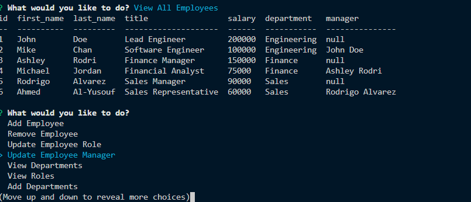

# Employee Tracker

## Description

Command Line CMS(Content management systme) to manage employees. The application runs on the command line. It is a two-teir application that is written in javascript and sql.

\*\* NPM dependencies:

- inquirer
- mysql
- console.table

## Table of Contents

- [Installation](#installation)
- [Usage](#usage)
- [License](#license)
- [Contributing](#contributing)
- [Tests](#tests)
- [Contact](#contact)

## Installation

Copy the link of the repository from the clone button, then run `git clone "the link of the repo"`. Once the repo cloned run the `npm install` to install all dependencies. Node js is required for this project.

## Usage

To start using this app, simply type the command `node companyDBConnection.js` then follow along with the prompts, hence there are some functionalities of the app that was not implemented.

**This is the landing page**

**Video of the running application**
[Video demo of the application](https://drive.google.com/file/d/1iEeJN6D0EWHOQq1Eb8fhZEizGD6r9uPN/view)

## License

Copyright (c) 2021 Alsharif Eid Nahas

MIT License

Permission is hereby granted, free of charge, to any person obtaining a copy
of this software and associated documentation files (the "Software"), to deal
in the Software without restriction, including without limitation the rights
to use, copy, modify, merge, publish, distribute, sublicense, and/or sell
copies of the Software, and to permit persons to whom the Software is
furnished to do so, subject to the following conditions:

The above copyright notice and this permission notice shall be included in all
copies or substantial portions of the Software.

THE SOFTWARE IS PROVIDED "AS IS", WITHOUT WARRANTY OF ANY KIND, EXPRESS OR
IMPLIED, INCLUDING BUT NOT LIMITED TO THE WARRANTIES OF MERCHANTABILITY,
FITNESS FOR A PARTICULAR PURPOSE AND NONINFRINGEMENT. IN NO EVENT SHALL THE
AUTHORS OR COPYRIGHT HOLDERS BE LIABLE FOR ANY CLAIM, DAMAGES OR OTHER
LIABILITY, WHETHER IN AN ACTION OF CONTRACT, TORT OR OTHERWISE, ARISING FROM,
OUT OF OR IN CONNECTION WITH THE SOFTWARE OR THE USE OR OTHER DEALINGS IN THE
SOFTWARE.

## Contributing

No contributions are being accepted at this time.

## Tests

Run `npm test` to run tests via the npm jest package.

## Contact

You can contact me at alsharifeid@gmail.com.  
You can also view my GitHub profile at https://github.com/alsharifnahas

© 2020 Alsharif Nahas. Confidential and Proprietary. All Rights Reserved.
